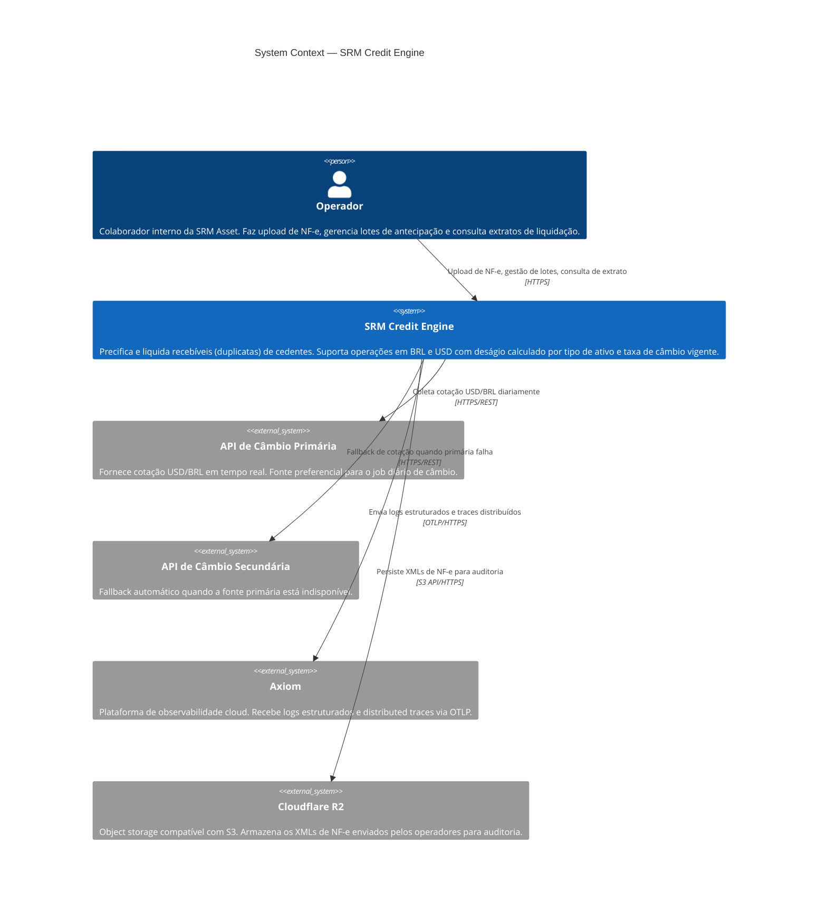
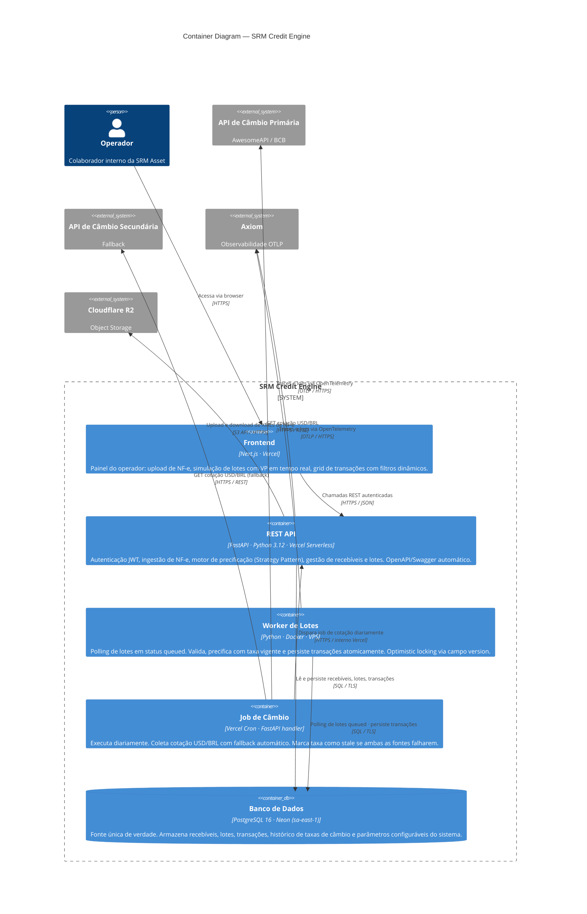

# C4 Diagrams — SRM Credit Engine

Documentação arquitetural nos níveis de Context e Container seguindo o modelo C4 (Simon Brown).

---

## Nível 1 — System Context

Mostra quem interage com o sistema e quais sistemas externos ele depende. Sem detalhes de tecnologia.

---

## Nível 2 — Container

Detalha os processos e datastores que compõem o sistema, a stack tecnológica de cada um e como se comunicam.

---

## Decisões de arquitetura representadas nos diagramas

**Vercel Serverless para API e Frontend** — elimina gestão de servidor para o escopo do desafio. A API é stateless por design, compatível com execução serverless. Documentado no README (seção Arquitetura de Deploy).

**VPS com Docker para o Worker** — lotes exigem processamento com estado e polling contínuo, incompatível com o modelo de execução efêmera da Vercel. Worker vive fora do perímetro serverless com acesso direto ao banco. Ver [ADR-0003](./adrs/0003-sync-nfe-processing.md).

**Neon PostgreSQL** — PostgreSQL gerenciado com branching de banco para ambientes, sem custo de RDS. Mesma interface do PostgreSQL convencional — sem lock-in de API proprietária.

**Cloudflare R2** — zero egress fees vs. S3. API S3-compatível permite troca sem reescrita de código. XMLs são imutáveis após upload — R2 é append-only na prática.

**Axiom para observabilidade** — evita infraestrutura local de Prometheus/Grafana. Free tier cobre o volume do projeto. Aceita OTLP nativamente sem agent intermediário. Ver [AI_USAGE.md](../AI_USAGE.md) (seção de decisões vetadas).

**Job de câmbio como handler da API com Vercel Cron** — para o escopo atual, o cron da Vercel dispara um endpoint protegido da própria API. Em produção AWS, seria substituído por EventBridge Scheduler + Lambda dedicada, sem impacto no código do handler.
