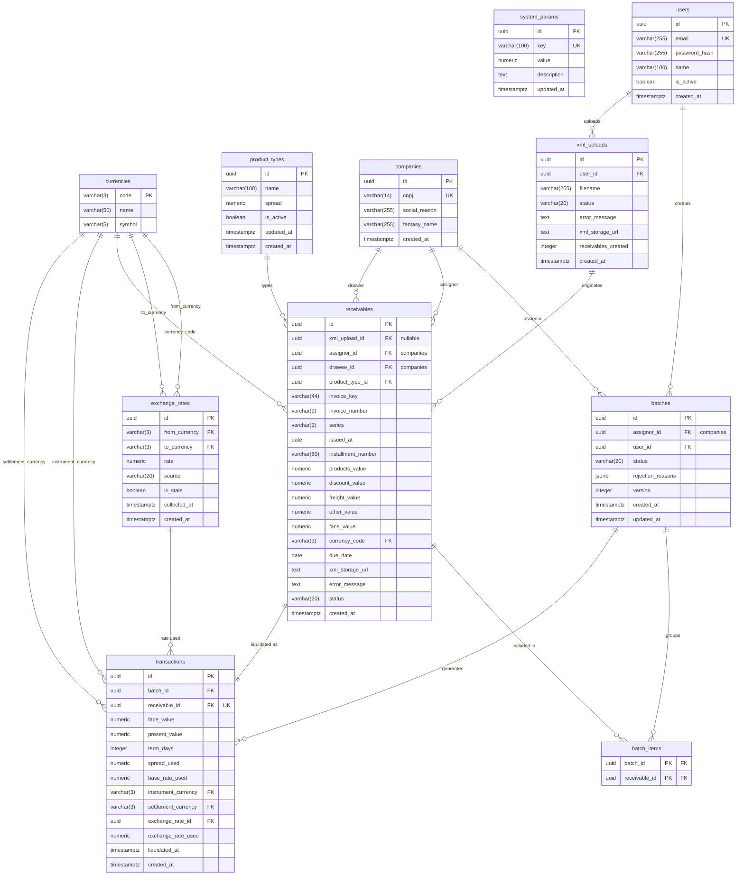

# ER Diagram — SRM Credit Engine

## Decisões de Modelagem

**`system_params`** armazena parâmetros globais como `monthly_base_rate` como registros chave-valor. Alterações não exigem redeploy.

**`product_types.spread`** é configurável em banco. O Strategy Pattern no código seleciona a regra por tipo, mas o valor do spread é sempre lido da tabela.

**`exchange_rates`** mantém histórico completo. `is_stale = true` sinaliza que a coleta falhou e o valor pode estar desatualizado. Operações cross-currency com taxa stale são bloqueadas.

**`transactions.exchange_rate_id + exchange_rate_used`** desnormalização intencional: `exchange_rate_id` garante rastreabilidade do registro histórico; `exchange_rate_used` congela o valor usado no cálculo para que o extrato nunca dependa de join para ser auditado — mesmo que o registro da taxa seja deletado ou corrigido no futuro.

**`batches.version`** habilita optimistic locking — previne que duas liquidações concorrentes do mesmo lote sejam processadas simultaneamente.

**`batches.rejection_reasons`** em JSONB permite retornar múltiplos motivos de recusa de forma estruturada sem normalização excessiva.

**`receivables`** existem de forma independente de lotes. Uma linha por duplicata — uma NF-e pode gerar múltiplas duplicatas com vencimentos distintos. A unicidade é garantida por `(invoice_key, installment_number)`.

**`receivables.assignor_id`** desnormalização intencional — o cedente está direto no recebível para evitar join obrigatório em toda listagem e extrato.

**`receivables.status`** ciclo de vida: `available` (elegível) → `in_batch` (bloqueado em solicitação pendente) → `anticipated` (liquidado). Rejeição de lote devolve para `available`.

**`receivables.xml_storage_url`** nullable — link ao XML original no R2 para auditoria. Preenchido apenas quando o upload é bem-sucedido.

**`xml_uploads`** lote de upload — um registro por ação do operador. `status = failed` indica que o XML era completamente ilegível (parse impossível). `receivables_created` permite auditoria rápida sem join.

**`receivables.xml_upload_id`** nullable — vincula o recebível ao lote de upload de origem. Ausente em recebíveis criados por outros canais futuros.

**`receivables.status = invalid`** recebível parseável mas com violação de regra de negócio (valor zero, CNPJ inválido, duplicata já existente). O campo `error_message` descreve o motivo. Recebíveis inválidos são visíveis ao operador mas nunca elegíveis para lotes de antecipação.

**`batch_items`** join table entre lotes e recebíveis. Desacopla a existência do recebível da solicitação de antecipação — suporta futuros canais de entrada sem XML.

**`companies`** unifica cedentes e sacados. O papel é inferido pela relação — `batches.assignor_id` e `receivables.assignor_id` indicam cedente; `receivables.drawee_id` indica sacado. O mesmo CNPJ pode exercer os dois papéis sem duplicidade de cadastro.
